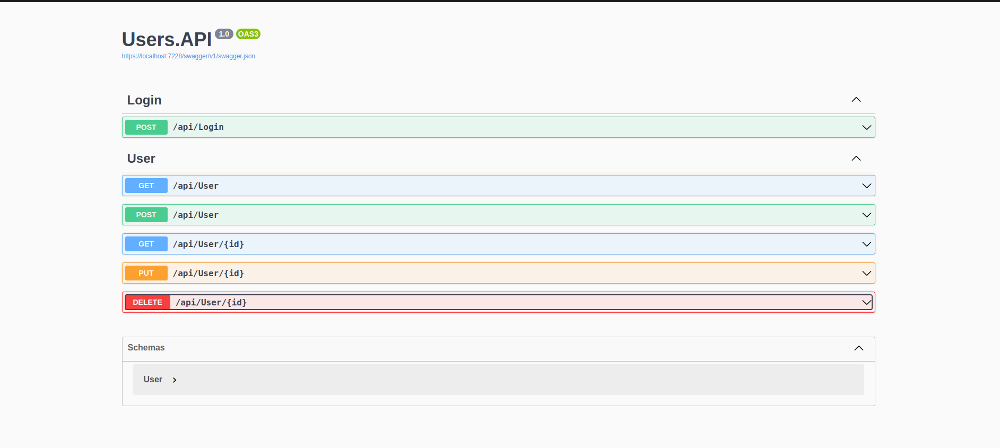

## 📝 Sobre 

- Este projeto foi criado apenas para entender o conceito básico de criação de uma Web API com C# e DotNet 6.

- A API é um CRUD de usuários.

## 🔏 Autenticação e autorização 

- Foi utilizado método para autenticação e autorização. Onde as rotas só podem ser acessadas após autenticação do usuário onde é gerado um token.
E algums métodos como PUT e DELETE são protegidos por claims para serem somente acessadas por usuários com Role "manager".

## 📦 Pacotes

- Foi utilizado os seguintes pacotes para o desenvolvimento do projeto: 

  > DotNetEnv                                          2.5.0   
  > Microsoft.AspNetCore.Authentication                2.2.0   
  > Microsoft.AspNetCore.Authentication.JwtBearer      3.1.32
  > Microsoft.EntityFrameworkCore                      7.0.5   
  > Microsoft.EntityFrameworkCore.Design               7.0.5   
  > Microsoft.EntityFrameworkCore.Tools                7.0.5   
  > MySql.EntityFrameworkCore                          7.0.0   
  > Swashbuckle.AspNetCore                             6.2.3 

## 🚀 Rotas

- /api/Login
- /api/User

